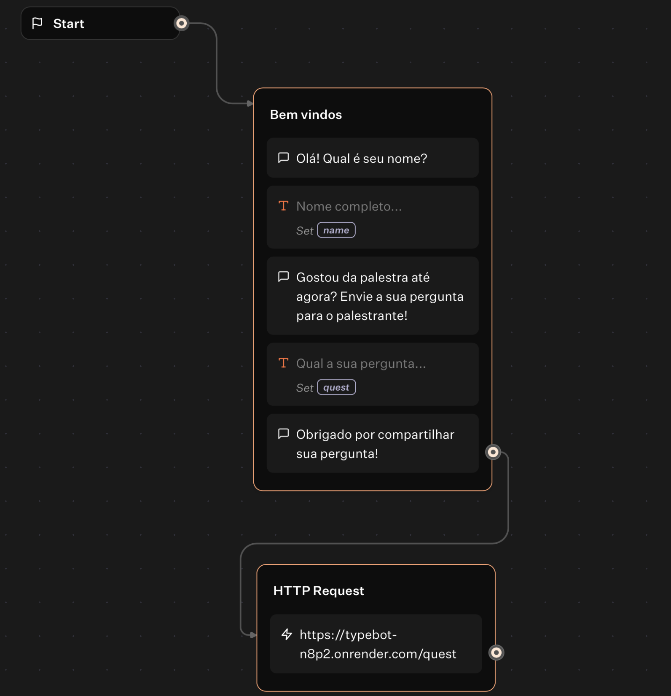

# Chatbot para Perguntas em Workshops com Golang, Vue.js e Typebot

Este projeto é uma aplicação simples que integra **Golang**, **Vue.js** e **Typebot** para coletar perguntas em eventos ou workshops. A solução permite que os participantes enviem perguntas via chatbot, que são armazenadas e exibidas em um painel administrativo (dashboard) feito com Vue.js.

## 🚀 Tecnologias Utilizadas
- **Golang** para o backend e API REST
- **Vue.js** para a interface do usuário embutida no HTML
- **Typebot** para a criação e integração do chatbot

---

## 📌 Funcionalidades
- Chatbot que recebe perguntas enviadas pelos usuários
- API REST desenvolvida em **Golang** para armazenar e fornecer os dados
- Dashboard em **Vue.js** para listar as perguntas em tempo real

---

## ⚙️ Estrutura do Projeto

### Backend (Golang)
A API foi desenvolvida utilizando `net/http` e possui as seguintes rotas:

- `POST /quest` - Adiciona uma nova questão
- `DELETE /quest/{index}` - Remove uma questão específica
- `GET /quests` - Lista todas as questões

---

### 1. Clonar o repositório

```bash
git clone git@github.com:MaiconGavino/typebot.git
cd typebot
```

### 2. Instalar dependências

Certifique-se de que todas as dependências estão instaladas:

```bash
go mod tidy
```

### 3. Executar o servidor

Para iniciar o servidor:

```bash
go run main.go
```

## Fluxo typebot


## 🎯 Melhorias Futuras
- Adicionar um **banco de dados** para armazenar as perguntas
- Criar uma **fila de processamento** para escalabilidade
- Melhorar a autenticação para restringir acesso ao dashboard

---

## 🔗 Links do Projeto
- **Bot para envio das perguntas:** [Typebot Link](https://typebot.co/my-typebot-37u25bq)
- **Dashboard para visualizar perguntas:** [Netlify Link](https://6798ef8bde7df8008a33ba5f--deft-rabanadas-8a6d67.netlify.app)

## Autor

Desenvolvido por Maicon Gavino.
Se chegou até aqui, deixa uma estrelinha no repositório!